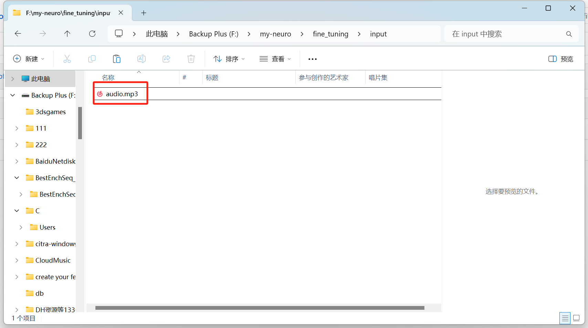
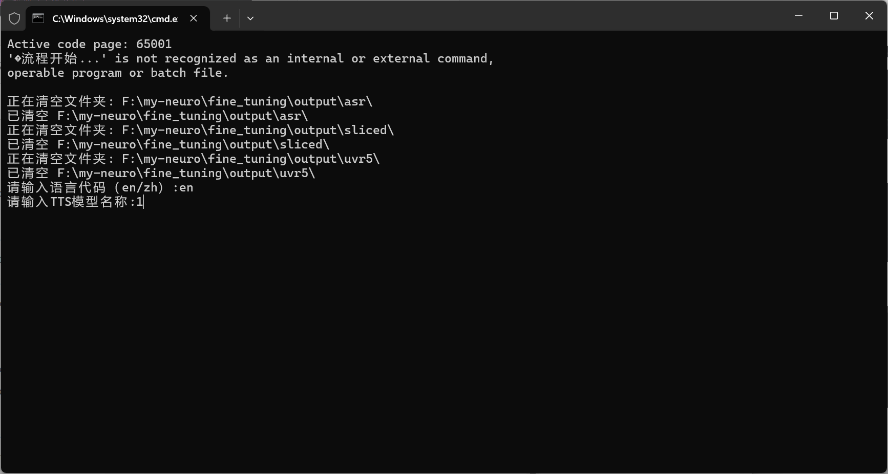
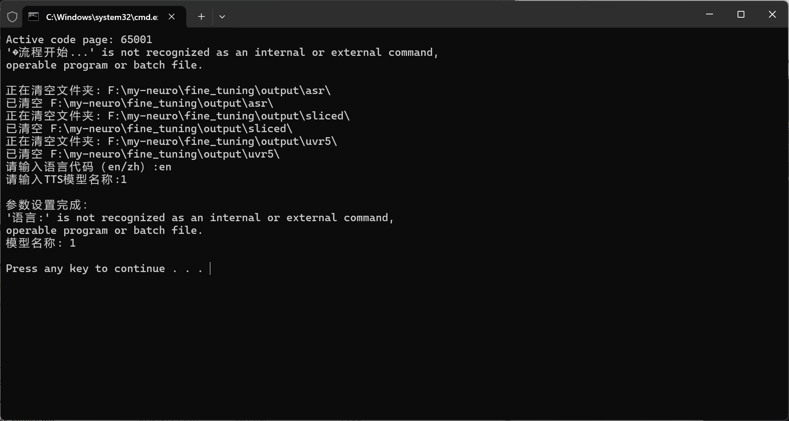
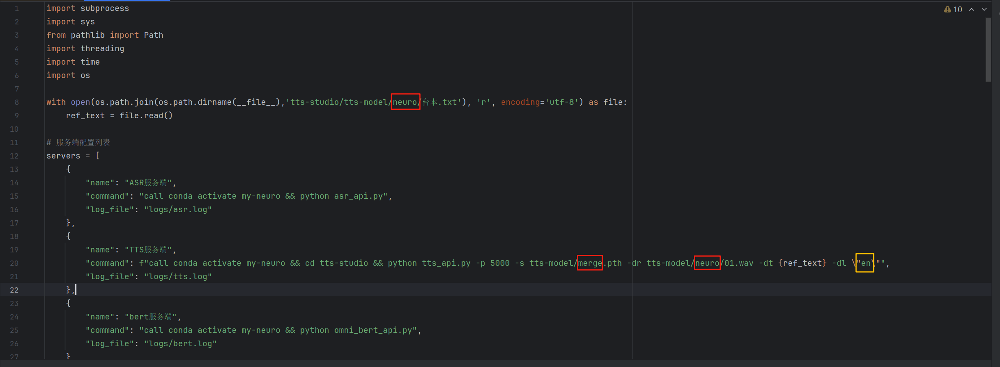
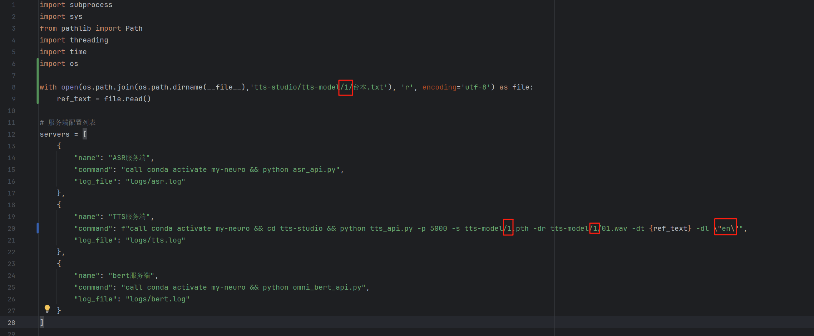

## 项目简介

本项目的目标是打造专属个人的 AI 角色,打造出逼近真人的AI伙伴 - 通过您的数据印记,塑造出心目中理想的 TA 的形象。

此项目受neuro sama启发，所以取名为my-neuro（社区提供的名称） 项目可训练声音、性格、替换形象 您的想象力有多丰富，模型就能多贴近您的期望。本项目更像是一个工作台。利用打包好的工具，一步步亲手描绘并实现心中理想的 AI 形象。

当前文档部署仅需6G显存不到，适配windows系统。同时需要有一个API-KEY 因为当前没有中转厂商来找我打广告，所以我不向各位推荐具体去哪里买API。但可以前往淘宝搜索“API”。里面有很多商家贩卖。也可以去deepseek、千问、智谱AI、硅基流动这些知名的官网购买。

如果你想用全部都用本地推理，使用本地的大语言模型（LLM）推理或者微调。不基于第三方的API的话，那可以进入LLM-studio文件夹，里面有本地模型的推理、微调指导。同时，因为本地的大语言模型需要一定的显存，要想有一个还算不错的体验，建议显卡至少保证有12G显存大小。

English Documentation: [English Version](./README_English.md)

## QQ群：756741478 （入群答案：肥牛）
## 客服

如果部署的时候遇到处理不了的bug可以前往此链接：http://fake-neuro.natapp1.cc


向肥牛客服询问，它会指导你如何处理项目可能出现的bug 不过大多数情况下不会有什么bug！也许..


如果肥牛客服解决不了，就点击页面右上角的这个"上传解决不了的报错"按键。点击后会直接把你和肥牛的对话记录发送到我的邮箱那去。

我就可以看见对话记录，从而针对性的修复bug或者告诉肥牛如何解决这个bug 下次再遇到就可以解决了！！

## 计划清单（打✔的是已经实现的功能）

### 双模型支持
- [x] 开源模型：支持开源模型微调，本地部署
- [x] 闭源模型：支持闭源模型接入

### 核心功能
- [x] 超低延迟：全本地推理，对话延迟在1秒以下
- [x] 字幕和语音同步输出
- [x] 语音定制：支持男、女声、各种角色声线切换等
- [x] MCP支持：可使用MCP工具接入
- [x] 实时打断：支持随时打断模型对话
- [ ] 真实情感：模拟真人的情绪变化状态，有自己的情绪状态。
- [ ] 超吊的人机体验(类似真人交互设计，敬请期待)
- [x] 动作表情：根据对话内容展示不同的表情与动作
- [x] 集成视觉能力，支持图像识别，并通过语言意图判断何时启动视觉功能
- [x] 声音模型（TTS）训练支持，默认使用gpt-sovits开源项目

### 扩展功能
- [ ] 桌面控制：支持语音控制打开软件等操作
- [x] AI唱歌（功能由： [@jonnytri53](https://github.com/jonnytri53) 资金赞助开发，特此感谢）
- [ ] 国外直播平台的接入
- [x] 直播功能：可在哔哩哔哩平台直播
- [ ] AI讲课：选择一个主题，让AI给你讲课。中途可提问。偏门课程可植入资料到数据库让AI理解
- [x] 替换各类live 2d模型
- [ ] web网页界面支持（已做好，近期会接入）
- [x] 打字对话：可键盘打字和AI交流
- [x] 主动对话：根据上下文主动发起对话。目前版本V1
- [x] 联网接入，实时搜索最新信息
- [x] 手机app应用：可在安卓手机上对话的肥牛
- [ ] 播放音效库中的音效，由模型自己决定播放何种音效
- [ ] 游戏陪玩，模型和用户共同游玩配合、双人、解密等游戏。目前实验游戏为：你画我猜、大富翁、galgame、我的世界等游戏
- [x] 长期记忆，让模型记住你的关键信息，你的个性，脾气

### 模型自己想要的功能（待定考虑）
- [ ] 变色功能：按照模型心情让屏幕变色妨碍用户
- [ ] 自由走动：模型自由在屏幕中移动

## 🚀 快速开始


## 新手设计一键部署项目（实验）

如果你是新手，可以使用这个一键部署指令。它会把所有的东西都处理好。但是由于涉及的逻辑处理过于多。所以有失败的可能性。但是成功了就会省去很多的麻烦。看你的运气了！

确保你电脑里安装了anaconda 如果还没有安装，可以去这里安装：https://www.anaconda.com/download/success

anaconda的安装流程可以参考这个视频，讲的很详细：https://www.bilibili.com/video/BV1ns4y1T7AP

已经有了anaconda环境后，就可以开始动手了！

先在项目路径下运行这个指令：

```bash
pip install modelscope requests
```

这条命令是安装一键部署所必须的requests和modelscope库，然后开始正式部署：

```bash
python neural_deploy.py
```

上面这两条指令运行好了以后，直接双击这个：Game-starts.bat 双击后会跳出来很多的窗口，默默等在这些窗口输出对应的ip


成功了后，你就可以直接跳到下面的第7步了，前1~6步都不需要做。如果失败了，就老实做下面的这些步骤吧


### 启动步骤
如果上面的一键处理出问题了。那么建议一步一步按照下方的操作方法。虽然麻烦。但是如果出错了。

也能立刻定位出错的位置，从而针对性的解决


1. 创建并激活虚拟环境（不要忘了这一步！！！！第一步很重要！！）
```bash
conda create -n my-neuro python=3.11 -y

conda activate my-neuro
```

2. 安装依赖(按照顺序执行！！！)
```bash
#独立安装jieba_fast依赖
pip install jieba_fast-0.53-cp311-cp311-win_amd64.whl

pip install -r requirements.txt

#安装ffmpedg
conda install ffmpeg -y

#安装cuda 默认是11.8 可以自行修改
pip install torch torchvision torchaudio --index-url https://download.pytorch.org/whl/cu118

```


3.自动下载需要的各种模型

```bash
conda activate my-neuro
python Batch_Download.py
```

下面4、5、6步需要你在my-neuro文件路径下面各自打开3个终端（cmd窗口）里运行

这4个终端就是你的后端，需要持续开启才能使用项目功能。

4.启动bert服务

```bash
conda activate my-neuro
python omni_bert_api.py
```

5.启动ASR服务
```bash
##第一次运行，会自动下载需要的模型
conda activate my-neuro
python asr_api.py
```

6.启动TTS服务
```bash
#进入tts-studio文件夹
cd tts-studio

#启动TTS服务
conda activate my-neuro
python tts_api.py -p 5000 -d cuda -s tts-model/merge.pth -dr tts-model/neuro/01.wav -dt "Hold on please, I'm busy. Okay, I think I heard him say he wants me to stream Hollow Knight on Tuesday and Thursday." -dl "en"
```


7.等待ASR和TTS都输出IP后，点击此链接下载zip文件：

https://github.com/morettt/my-neuro/releases/download/v4.5/live-2d.zip


下载后解压是这样的，双击打开这个 肥牛.exe 文件


按照箭头指示点击LLM标签，在框选的这三个地方填写你的API信息，修改好了记得点击下面的保存。（我在这里已经写了一个可以用的api配置，你可以删除改成你自己的。支持任何openai格式的api）


最后返回点击"启动桌宠" 等待皮套出现，就可以开始和模型聊天了


如果有任何问题，在终端运行以下命令以启动诊断工具
```bash
conda activate my-neuro
python diagnostic_tool.py
```
运行后将会弹出一个窗口，里面包含了后端诊断信息和一键修复按钮，若不能自行解决问题，向客服提供输出信息

## 定制tts模型（克隆音色）

该模块由[@jdnoeg](https://github.com/jdnoeg)基于GPT-SoVITS项目制作

注：本模块需要在完成虚拟环境配置后进行

该模块可以使用一段音频一键克隆你想要的角色的音色

音频要求：长度在10min~30min之间，mp3格式，可以有背景音乐，但是只能有一个说话人

硬件要求：显存至少6G的显卡

1.把你的音频文件放在fine_tuning/input文件夹下，改名为"audio.mp3"，如图



第一次用的时候这个位置会有一个占位符.txt，建议删掉，不删也没关系，但是会有些不会影响进程的报错

2.这一步需要科学上网运行

双击运行 一键克隆音色.bat ，在弹出的窗口中输入你的音频使用的语言以及你的tts模型的名称（自己起一个，示例使用"1"），如图



这时候会出现这样的情况：



不用管，键盘上随便按一个键就可以继续正常运行

在脚本运行期间不要关闭窗口！！！

3.脚本运行完成后，修改配置以使用你训练好的模型

打开run_server.py进行编辑（有IDE的可以用，没有的直接右键记事本打开）

需要修改的地方一共有如图所示的四处：



红色框的地方全部改成你在步骤2中输入的模型名称，黄色框的地方改成你输入的音频的语言，如下图



修改完成后一定不要忘记保存！！！

关掉文件，双击Game-starts.bat运行服务端，这时候tts使用的就是你训练好的模型了

想改回默认的模型只需要把你修改过的内容再改回原来的样子就行

## 定制AI

有定制属于自己的AI的需求，请打开LLM-studio 文件夹，在此文件夹中内有关于LLM的微调操作步骤。

目前定制化模块将逐渐增加...


### 结尾画饼

我会把这几年的经验和对技术的理解都加入到此项目中。my neuro 这个名字除了蹭neuro sama的热度以外 更多的是我对AI边界的想象和期待

希望有一个真正的能懂你，理解你，且永远不会觉得无聊的AI陪伴在身旁。难受就一起难受，开心就一起开心。让影视作品、小说。幻想中的形象来到现实里

不仅仅是简单的聊天交互。希望它可以融入生活，成为一个有感情的个体。一起开黑玩游戏、看视频、学习东西、睡前聊天、叫你起床、工作时不说话看你发呆，会偷偷记住你做了什么。有情绪，有属于自己的情感状态。会真正的生气

每天都会有自己的情绪变化，会有自己想要做的事。会对某句话难受很久。某个词开心很久。会记住和你在一起经历过的每一个时刻。持续理解你的一个存在。

不过最重要的是，它的个性、样子、声音，情感变化等。都由你决定，就像橡皮泥，我们来提供最好的工具，做好每个模块适配。但最终是怎么样的，由自己来构造。

不过，对于不想折腾的朋友。此项目也直接打包了一个角色，就是肥牛（fake neuro）它是一个抄袭neuro sama的角色，但是个性我把它设定成了一个腹黑、傲娇、搞笑、有小脾气，但偶尔也会展现温柔一面的样子。

更希望的是从neuro 那里模仿借鉴，理解。然后尝试创造新的内容。适合自己的东西。

我对此项目特别的有热情。当前项目已经实现了将近30%的功能。包括定性格、记忆。近期会围绕核心性格特征。也就是真正像人，有持续的情绪这块地方来开发。会在2个月内实现最像人的那部分，就是一个长期的情绪状态。同时开黑玩游戏、看视频、叫你起床等等这块部分等功能都会在6月1日前基本完成，达到60%的完成度。

希望能在今年可以把上述所有的想法都实现。

## 致谢

QQ群:感谢 菊花茶洋参 帮忙制作肥牛app的封面


感谢以下用户的资金赞助：
- [@jonnytri53](https://github.com/jonnytri53) - 感谢您的支持！ 为本项目捐赠的50美元
- [@蒜头头头](https://space.bilibili.com/92419729?spm_id_from=333.337.0.0) 感谢您的大力支持！为本项目捐赠的1000人民币

感谢大佬开源十分好用的tts：
GPT-SoVITS：https://github.com/RVC-Boss/GPT-SoVITS


